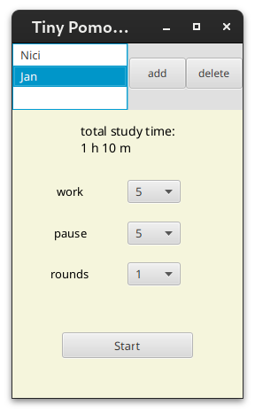

# Pomodoro Timer

---

## Description

A small Pomodoro timer to help increase productivity by scheduling regular breaks.

## Installation

#### Requeirements

- Linux (actually not Windows/Mac)
- [java (OpenJDK 22)](https://jdk.java.net/22/)
- [javafx 21 -sdk](https://gluonhq.com/products/javafx/)
  (if you want to code. Not for the download below.
  JavaFX Lib is inside the download zip)

---

1. [Download](https://github.com/JT-808/Tiny-PomoPal/releases)
2. unzip
3. execute the script.

checksum: 30d9f04471f99d960c0c815e641408b1137fc331e542607773d1b9ea566ec0b0 (SHA256)

## Features

- Customizable Work and Break Times and Number of Rounds

- Start Delay

- Manage Profiles

- Audio Notifications

- Local Profile Storage

- Work Time Tracking

- View Total Work Time

## Coming Soon

- coming soon
